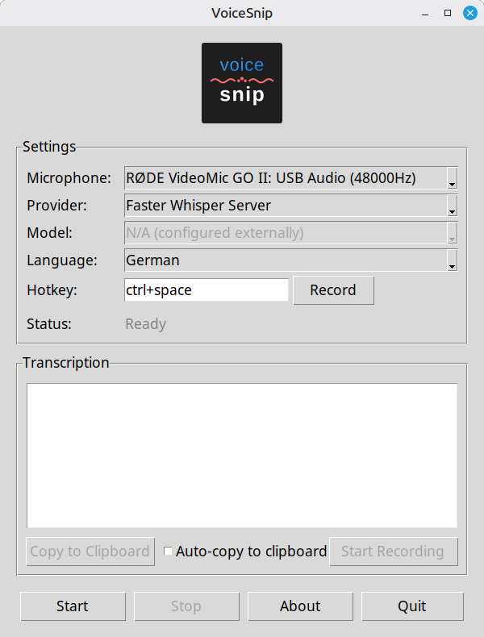

# VoiceSnip - Push-to-Talk Speech-to-Text for Linux

Push-to-Talk Speech-to-Text application with multiple provider support and intuitive GUI.



## Features

- 🎤 **Push-to-Talk**: Hold your configured hotkey to record
- 🔄 **Multiple Providers**: Whisper Local (CPU/GPU), Faster Whisper Server, or Deepgram Cloud
- ⌨️ **Configurable Hotkeys**: Set any key combination (Ctrl+Space, Alt+R, etc.)
- 🖥️ **Simple GUI**: Easy microphone, provider, language, and hotkey configuration
- 🌍 **Multi-Language**: German, English, or Auto-Detection
- 🎮 **GPU Acceleration**: Significantly faster Whisper with NVIDIA GPU
- 🔌 **Smart Device Detection**: Automatically filters physical microphones
- 🔒 **Privacy-First**: Local Whisper keeps all data on your device
- 🇪🇺 **EU Region Available**: Deepgram offers European endpoints for data residency

## Provider Comparison

| Feature          | Whisper Local CPU                          | Whisper Local GPU                          | Faster Whisper Server                            | Deepgram Cloud                                  |
| ---------------- | ------------------------------------------ | ------------------------------------------ | ------------------------------------------------ | ----------------------------------------------- |
| **Cost**         | Free                                       | Free                                       | Free (self-hosted)                               | [Deepgram Prices](https://deepgram.com/pricing) |
| **Requirements** | None                                       | NVIDIA GPU + CUDA                          | Faster Whisper Server running                    | API key, Internet                               |
| **Privacy**      | Local processing                           | Local processing                           | Local/network processing                         | Cloud processing                                |
| **Internet**     | Model download only                        | Model download only                        | Server setup only                                | Required                                        |
| **Setup**        | Auto-downloads model                       | Auto-downloads model                       | Configure endpoint                               | API key needed                                  |
| **Models**       | tiny, base, small, medium, large-v3, turbo | tiny, base, small, medium, large-v3, turbo | Configured on server                             | nova-2-general, nova-2                          |
| **Best for**     | Privacy, offline use                       | Speed + Privacy                            | Distributed setups, GPU sharing                  | Fastest setup                                   |

**Note**:

- Available models are predefined in VoiceSnip and shown in the GUI dropdown menu. Select your preferred model and it will be saved for future sessions.
- VoiceSnip supports the listed Deepgram models.

## Requirements

VoiceSnip requires X11 display server for desktop integration (xclip, xdotool, xprop). Wayland is not supported at the moment.

## Installation

**Note**: The automated installation script (`install.py`) is designed for **Debian/Ubuntu-based systems** using `apt` package manager. For other Linux distributions, you'll need to manually install the equivalent system packages and then use `pip install -r requirements.txt` or `requirements_cuda.txt` in a virtual environment. The needed system packages are listed in `system_requirements.txt` or `system_requirements_cuda.txt`.

### 1. Clone Repository

```bash
git clone https://github.com/Stefan-Schmidbauer/voicesnip.git
cd voicesnip
```

### 2. Run the Installer

VoiceSnip uses a profile-based installation system. Choose the profile that fits your needs:

```bash
./install.py
```

**Available Profiles:**

| Profile      | Description                                                              | Providers Available                                                       |
| ------------ | ------------------------------------------------------------------------ | ------------------------------------------------------------------------- |
| **basis**    | Whisper Local CPU + Deepgram Cloud transcription                         | Whisper Local CPU, Deepgram Cloud                                         |
| **cuda**     | Local Whisper with GPU support                                           | Whisper Local CPU, Whisper Local GPU, Deepgram Cloud                      |
| **server**   | Faster Whisper Server via remote/network connection                      | Faster Whisper Server, Deepgram Cloud                                     |
| **full**     | All providers: Local Whisper (CPU+GPU) + Faster Whisper Server          | Whisper Local CPU, Whisper Local GPU, Faster Whisper Server, Deepgram    |

**Installation Flow:**

1. The installer shows available profiles
2. You select your preferred profile (basis or cuda)
3. Installer checks system packages - if missing, shows `sudo apt install ...` command
4. Install missing system packages, then re-run installer
5. Installer creates virtual environment and installs Python packages
6. Installation complete!

**Quick Install (Non-Interactive):**

```bash
./install.py --profile basis   # For Deepgram + Whisper CPU
./install.py --profile cuda    # For Deepgram + Whisper CPU/GPU
./install.py --profile server  # For Deepgram + Faster Whisper Server
./install.py --profile full    # For all providers
```

### 3. Configuration

**For Deepgram (Cloud)**: Create a `.env` file for your API key:

```bash
cp .env.example .env
nano .env
```

Add your Deepgram API key and adjust the URL if needed:

```bash
DEEPGRAM_API_KEY=your_api_key_here
DEEPGRAM_ENDPOINT=https://api.eu.deepgram.com/v1/listen
```

**Note**: The default endpoint uses the EU region (`api.eu.deepgram.com`). For US region, use `https://api.deepgram.com/v1/listen`.

**For Faster Whisper Server**: Configure the server endpoint in your `.env` file:

```bash
# Faster Whisper Server Configuration
FASTER_WHISPER_ENDPOINT=http://your-server:8000/v1/audio/transcriptions
# FASTER_WHISPER_API_KEY=your_api_key_here  # Optional, only if server requires authentication
```

**Note**: The model is configured on the Faster Whisper Server itself (not in VoiceSnip). The server must be running and accessible before using this provider.

### 4. Start VoiceSnip

```bash
./start.sh
```

The application will start with providers available based on your installation profile!

### Switching Profiles

To switch from one profile to another, simply run the installer with the desired profile:

```bash
# Switch from basis to cuda (adds GPU support)
./install.py --profile cuda

# Switch from cuda to basis (keeps existing packages)
./install.py --profile basis
```

By default, the installer reuses the existing virtual environment and adds/updates packages as needed.

If you want to rebuild the virtual environment from scratch (clean install):

```bash
./install.py --profile cuda --rebuild-venv
```

**Note**: Rebuilding is rarely necessary. Use it only if you encounter issues with the installation.

## Usage

### Start Application

**Recommended**: Use the provided shell script:

```bash
./start.sh
```

### How to Use

1. **Select Microphone**: Choose your input device from the dropdown
2. **Select Provider**: Choose between:
   - **Whisper Local CPU** - Free, works everywhere
   - **Whisper Local GPU** - Free, much faster with NVIDIA GPU! 🚀
   - **Faster Whisper Server** - Network/remote server access
   - **Deepgram Cloud** - Requires API key, fastest setup
3. **Select Model**: Choose model size (auto-populated based on provider)
4. **Select Language**: Choose German, English, or Auto-Detection
5. **Configure Hotkey** (Optional):
   - Click the "Record" button next to the hotkey field
   - Press your desired key combination (e.g., Ctrl+Space (default), Alt+R)
   - The hotkey will be automatically detected and saved
6. **Start**: Click "Start" button
   - **First time with Whisper**: Model will download automatically
   - **Be patient!** Large models are several GB and take time to download (see sizes below)
   - Downloads happen only once, then cached locally
   - **Your settings are automatically saved** - next time you start the app, your last used Provider, Model, Language, Microphone, and Hotkey will be pre-selected!
7. **Record**: Hold your configured hotkey and speak
8. **Transcribe**: Release the hotkey - text will be automatically inserted
9. **Stop**: Click "Stop" button when done

### Whisper Model Selection

Available models are predefined in the application:

| Model        | Download Size | GPU VRAM | Comment                 |
| ------------ | ------------- | -------- | ----------------------- |
| **tiny**     | ~78 MB        | ~230 MB  |                         |
| **base**     | ~149 MB       | ~330 MB  |                         |
| **small**    | ~488 MB       | ~745 MB  | **Recommended for CPU** |
| **medium**   | ~1.5 GB       | ~2 GB    |                         |
| **turbo**    | ~1.6 GB       | ~2.2 GB  | **Recommended for GPU** |
| **large-v3** | ~3.1 GB       | ~3.9 GB  |                         |

**Important Notes:**

- **Download Size**: One-time download from Hugging Face on first use
- **GPU VRAM**: Memory usage measured on RTX 4050 laptop GPU (only relevant when using GPU provider)
- The model is automatically unloaded from VRAM when you click "Stop" or "Quit"

## Project Structure

```
voicesnip/
├── main.py                    # Application entry point
├── start.sh                   # Startup script (activates venv and runs main.py)
├── install.py                 # Installation script
├── voicesnip/                 # Main application package
│   ├── constants.py           # Application constants
│   ├── core.py                # Core orchestration logic
│   ├── audio_recorder.py      # Audio recording functionality
│   ├── hotkey_manager.py      # Hotkey management
│   ├── text_inserter.py       # Text insertion (xdotool)
│   └── gui/                   # GUI components
│       ├── main_window.py     # Main application window
│       ├── config_manager.py  # Configuration loading/saving
│       ├── device_manager.py  # Audio device management
│       └── dialogs.py         # About and info dialogs
├── providers/                 # STT provider implementations
│   ├── base.py                # Base provider class
│   ├── whisper.py             # Whisper (local) provider
│   ├── faster_whisper_server.py # Faster Whisper Server provider
│   └── deepgram.py            # Deepgram (cloud) provider
├── assets/                    # Application assets
│   └── icons/
│       ├── actions/           # SVG icons for external integrations
│       └── app/               # Application icon files
└── quickstrap/                # Installation profiles and scripts
    ├── installation_profiles.ini
    └── scripts/
```

## File Locations

VoiceSnip creates and uses the following files and directories:

### Configuration Files

**In installation directory:**

- **`.env`**: Contains API keys and endpoint configuration (Deepgram, Faster Whisper Server)

**In `~/.config/voicesnip/`:**

- **`config.json`**: Stores your GUI settings (provider, model, language, microphone, hotkey, window dimension)
- **`installation_profile.ini`**: Stores the installed profile and features (created by installer)

### Cache Directories

- **`~/.cache/huggingface/hub/`**: Whisper model cache directory
  - Downloaded models are stored here (can be several GB depending on model size)
  - Safe to delete if you want to reclaim disk space after uninstalling VoiceSnip
  - Models will be re-downloaded on next use if deleted

## License

MIT License - see LICENSE file for details.

### Third-Party Technologies

VoiceSnip integrates with these excellent services and technologies:

- **OpenAI Whisper** (MIT License) - local speech recognition
- **Deepgram** - cloud speech recognition API
- **NVIDIA CUDA** - GPU acceleration

This is an independent project and not affiliated with OpenAI, Deepgram, NVIDIA, Elgato, or Anthropic.

## Contributing

Issues and pull requests are welcome!

## Development

This project was developed with AI assistance (Claude/Anthropic) as co-author. See commit history for details.

## Author

Stefan Schmidbauer
