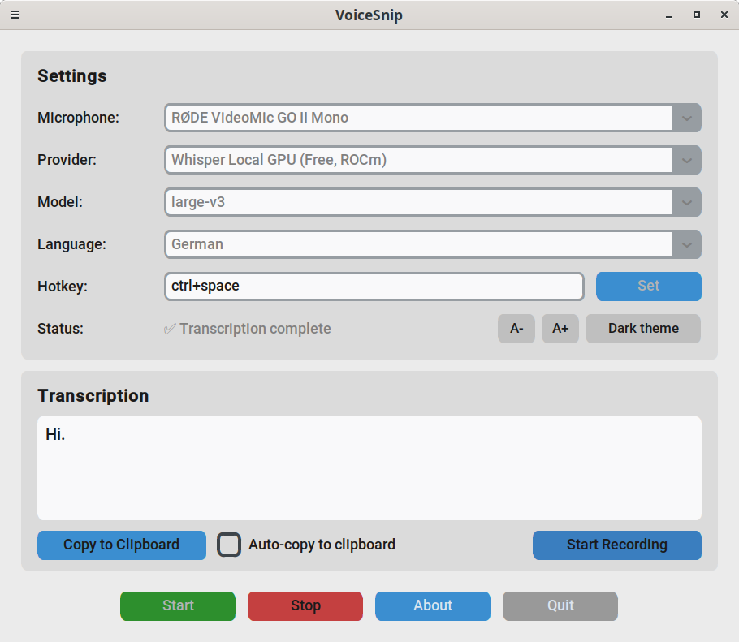

# VoiceSnip - Push-to-Talk Speech-to-Text

Local push-to-talk speech-to-text for Linux. Hold a hotkey, speak, release - text appears at your cursor.

All processing happens locally on your GPU. No cloud, no server, no data leaves your machine.



## Features

- **Push-to-Talk**: Hold hotkey to record, release to transcribe
- **Local GPU Processing**: Whisper runs directly on your NVIDIA (CUDA) or AMD (ROCm) GPU
- **Privacy-First**: All data stays on your device
- **Configurable Hotkeys**: Any key combination (Ctrl+Space, Alt+R, etc.)
- **Multi-Language**: 10 languages (German, English, French, Spanish, etc.) + Auto-Detection
- **Dark/Light Mode**: Switch between dark and light themes
- **Adjustable Font Size**: A-/A+ buttons to customize text size

## Requirements

- Linux (X11 or Wayland)
- Python 3.8+
- NVIDIA GPU with CUDA **or** AMD GPU with ROCm
- Debian/Ubuntu for automated system package install

## Installation

```bash
git clone https://github.com/Stefan-Schmidbauer/voicesnip.git
cd voicesnip
./install.py
```

The installer will ask you to choose a profile:

| Profile  | Description                                              |
| -------- | -------------------------------------------------------- |
| **cuda** | Whisper with NVIDIA GPU acceleration (requires CUDA)     |
| **rocm** | Whisper with AMD GPU acceleration (requires ROCm, Linux) |

### GPU Setup

**NVIDIA (CUDA):** Install [NVIDIA drivers](https://developer.nvidia.com/cuda-downloads). CUDA libraries are installed automatically by the installer.

**AMD (ROCm):** Install [ROCm drivers](https://rocm.docs.amd.com/projects/install-on-linux/en/latest/) first. PyTorch ROCm is installed automatically by the installer.

## Usage

```bash
./start.sh
```

1. Select your microphone
2. Click "Start"
3. Hold your hotkey (default: Ctrl+Space) and speak
4. Release - text appears at your cursor

## Wayland Support

VoiceSnip works on both X11 and Wayland, but with different workflows due to Wayland's security model.

### X11 (Full Support)

- **Global hotkeys work** - Hold Ctrl+Space (or your configured hotkey) anywhere
- Text is automatically inserted at your cursor via xdotool

### Wayland (GUI-Based Recording)

Wayland blocks global keyboard hooks for security reasons. VoiceSnip provides an alternative:

1. Click **"Start Recording"** in the GUI (instead of hotkey)
2. Speak, then click **"Stop Recording"**
3. Enable **"Auto-copy to clipboard"** for automatic copying
4. Switch to your target app and **Ctrl+V** to paste

## Whisper Models

| Model    | Size   | VRAM   | Notes                   |
| -------- | ------ | ------ | ----------------------- |
| tiny     | 78 MB  | 230 MB | Fastest, lowest quality |
| base     | 149 MB | 330 MB |                         |
| small    | 488 MB | 745 MB | Good balance            |
| medium   | 1.5 GB | 2 GB   |                         |
| turbo    | 1.6 GB | 2.2 GB | **Recommended for GPU** |
| large-v3 | 3.1 GB | 3.9 GB | Best quality            |

Models download automatically on first use to `~/.cache/huggingface/`.

## Configuration

Settings are saved automatically in the project directory:

| File                    | Purpose              |
| ----------------------- | -------------------- |
| `.env`                  | Environment config   |
| `voicesnip_config.json` | GUI settings         |
| `voicesnip_profile.ini` | Installation profile |

## Looking for Server-Based STT?

If you want to connect to a remote STT server (e.g., in a team/Docker setup), check out [Ancroo Voice](https://github.com/Stefan-Schmidbauer/ancroo-voice) — a lightweight binary client for the Ancroo Stack.

## License

MIT License - see LICENSE file.

**Third-Party:** OpenAI Whisper (MIT), NVIDIA CUDA, AMD ROCm

## Author

Stefan Schmidbauer

---

_Developed with AI assistance (Claude/Anthropic)_
