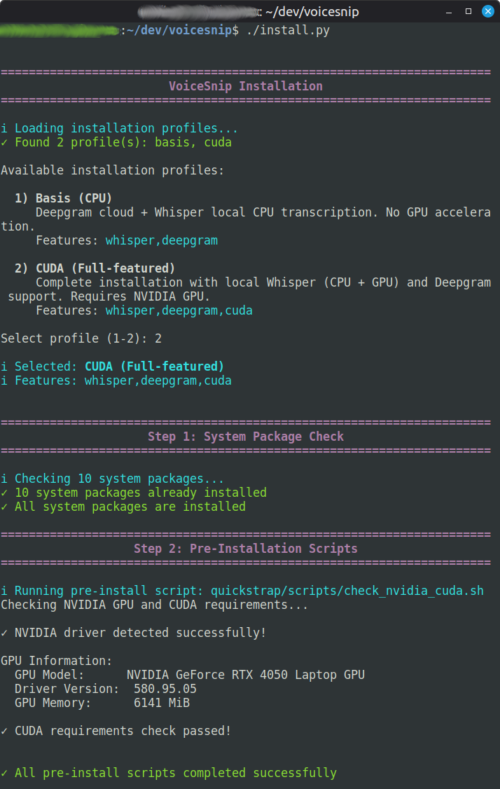

# Quickstrap

**A lightweight, profile-based installation framework for Python projects**

Quickstrap provides a simple, reusable installation system that handles both Python packages (pip) and system packages (apt/dpkg), with support for multiple installation profiles, post-install hooks, and a symmetric uninstall.

## Features

- **Profile-Based Installation** - Define multiple installation profiles (e.g. minimal, standard, full, development)
- **Hybrid Package Management** - Manages both system packages (apt) and Python packages (pip)
- **Virtual Environment** - Automatic venv creation and management
- **Feature Detection** - Applications can detect which features were installed
- **Post-Install Hooks** - Run custom scripts after installation
- **Symmetric Uninstall** - `--uninstall` removes the venv and generated files, runs your uninstall scripts, and lists system packages to remove
- **Template-Driven** - No code changes needed, just configure INI files
- **Copy-and-Go** - Clone, configure, and you're ready to deploy
- **Versioned Engine** - Each project carries a known framework version (`--version`) and can pull engine updates with `--update-framework`, leaving its own config untouched

## Quick Start

### For New Projects

1. **Clone Quickstrap into your project:**

   ```bash
   git clone https://github.com/Stefan-Schmidbauer/quickstrap.git my-project
   cd my-project
   # Rename Quickstrap README to make room for your project's README
   mv README.md README.quickstrap.md
   ```

2. **Configure your application:**
   Edit `quickstrap/installation_profiles.ini`:

   - Set your app name, config directory, and start command
   - Define your features
   - Uncomment and customize profiles as needed

3. **Add your dependencies:**

   - Edit `quickstrap/requirements_python.txt` - add your Python packages
   - Edit `quickstrap/requirements_system.txt` - add your system packages

4. **Add your application code:**

   ```bash
      # Create your Python application
   ```

5. **Install and run:**

   ```bash
   ./install.py
   ./start.sh
   ```



The interactive installation process guides users through profile selection and automatically verifies system requirements.

### For Existing Projects

1. **Add Quickstrap to your project:**

   ```bash
   cd your-existing-project
   git clone https://github.com/Stefan-Schmidbauer/quickstrap.git quickstrap-temp
   cp quickstrap-temp/install.py .
   cp quickstrap-temp/start.sh .
   cp quickstrap-temp/README.md README.quickstrap.md  # Keep Quickstrap docs as reference
   cp -r quickstrap-temp/quickstrap .
   rm -rf quickstrap-temp
   ```

2. **Configure and install:**
   - Edit `quickstrap/installation_profiles.ini`
   - Add dependencies to `quickstrap/requirements_*.txt`
   - Run `./install.py`

## Installation Profiles

Profiles allow you to define different installation scenarios:

```ini
[profile:minimal]
name = Minimal Installation
description = CLI-only installation
features = cli
python_requirements = quickstrap/requirements_python.txt
system_requirements = quickstrap/requirements_system.txt

[profile:full]
name = Full Installation
description = Complete installation with all features
features = gui,pdf,database,printing,api
python_requirements = quickstrap/requirements_python_full.txt
system_requirements = quickstrap/requirements_system_full.txt
post_install_scripts = quickstrap/scripts/init_database.sh
```

## Feature Detection

Your application can detect which features were installed by reading the configuration file created by Quickstrap:

```python
from pathlib import Path
from configparser import ConfigParser

def get_installed_features(app_name: str) -> set:
    """Read installed features from Quickstrap config (stored in project directory)."""
    # Config file is in the project directory with app-specific name
    config_file = Path(__file__).parent / f'{app_name.lower()}_profile.ini'

    if not config_file.exists():
        return set()

    config = ConfigParser()
    config.read(config_file)

    features_str = config.get('installation', 'features', fallback='')
    return set(f.strip() for f in features_str.split(',') if f.strip())

# Usage:
features = get_installed_features('my-app')  # looks for ./my-app_profile.ini

if 'gui' in features:
    import tkinter
    # Enable GUI features

if 'pdf' in features:
    from reportlab.pdfgen import canvas
    # Enable PDF generation
```

The configuration is stored in the project directory: `./{app_name}_profile.ini` (e.g., `myapp_profile.ini`)

## Pre-Install Scripts

Pre-install scripts run **before** the virtual environment is created and packages are installed. This prevents wasting time installing packages when critical requirements are missing (e.g., GPU drivers for CUDA applications).

Because they run before the venv exists, pre-install scripts do **not** receive the `QUICKSTRAP_*` environment variables or `VIRTUAL_ENV` - those are provided to post-install and uninstall scripts only.

Add pre-install scripts to your profile:

```ini
[profile:cuda]
name = CUDA Installation
...
pre_install_scripts = quickstrap/scripts/check_nvidia_driver.sh
```

### How Pre-Install Scripts Work

1. **Timing**: Scripts run after system package verification but before venv creation
2. **Failure Handling**: If a script fails, the user is prompted to continue or abort
3. **Multiple Scripts**: Comma-separated list, all scripts run in order
4. **Exit Codes**: Script exit 0 = success, non-zero = failure

### Example: NVIDIA Driver Verification

Quickstrap includes a template for verifying NVIDIA GPU drivers:

`quickstrap/scripts/check_nvidia_driver.sh` - Verify NVIDIA drivers for CUDA applications

Uncomment and customize the template to check for:

- nvidia-smi availability
- GPU detection
- Minimum driver version requirements

**Example script:**

```bash
#!/bin/bash
if ! command -v nvidia-smi >/dev/null 2>&1; then
    echo "Error: NVIDIA driver not found (nvidia-smi not available)"
    echo ""
    echo "Install NVIDIA drivers:"
    echo "  1. Check available versions: apt search nvidia-driver"
    echo "  2. Install driver: sudo apt install nvidia-driver-XXX"
    echo "  3. Reboot system"
    exit 1
fi
echo "✓ NVIDIA driver found"
exit 0
```

### User Experience

When a pre-install script fails:

```
Step 2: Pre-Installation Scripts
[i] Running pre-install script: quickstrap/scripts/check_nvidia_driver.sh
Error: NVIDIA driver not found (nvidia-smi not available)

Install NVIDIA drivers:
  1. Check available versions: apt search nvidia-driver
  2. Install driver: sudo apt install nvidia-driver-XXX
  3. Reboot system

[X] Pre-install script failed: quickstrap/scripts/check_nvidia_driver.sh

[!] Warning: Pre-installation scripts failed
Continue anyway? [y/N]: _
```

The user can choose to:

- Press `N` or `Enter` to abort (recommended)
- Press `y` to continue despite the failed script

## Post-Install Scripts

Add custom setup scripts that run after package installation:

```ini
[profile:standard]
...
post_install_scripts = quickstrap/scripts/init_database.sh,quickstrap/scripts/check_deps.sh
```

Quickstrap includes template scripts in `quickstrap/scripts/`:

**Pre-Install Scripts** (run before venv creation):

- `check_nvidia_driver.sh` - Verify NVIDIA GPU drivers for CUDA applications
- `check_docker.sh` - Verify Docker and Docker Compose availability
- `check_port_available.sh` - Check if required ports are free for web applications
- `check_python_version.sh` - Verify Python version meets requirements

**Post-Install Scripts** (run after package installation):

- `init_sqlite_database.sh` - Initialize SQLite database
- `setup_config_directory.sh` - Create config directories
- `setup_desktop_entry.sh` - Create .desktop file for desktop integration
- `check_file_exists.sh` - Verify required files exist
- `check_cups_printing.sh` - Verify CUPS printing system

**Uninstall Scripts** (run during `./install.py --uninstall`):

- `uninstall_example.sh` - Template showing how to undo out-of-tree side effects

Simply uncomment and customize these templates for your needs. All templates include extensive examples showing common use cases.

If the script fails, the installation fails.

### Environment Variables Available to Scripts

Post-install and uninstall scripts have access to these environment variables:

- `QUICKSTRAP_APP_NAME` - The application name from metadata
- `QUICKSTRAP_CONFIG_DIR` - Path to the project directory (where config files are stored)
- `VIRTUAL_ENV` - Path to the virtual environment (e.g., `/path/to/project/venv`)
- `PATH` - Automatically updated to include the venv's `bin` directory first. This ensures that when your script calls `python`, `pip`, or any installed Python tools, the versions from the virtual environment are used instead of system versions. You can directly use commands like `python script.py` without specifying the full venv path.
- `QUICKSTRAP_STATE_FILE` - Path to a state file shared by all of this installation's scripts (see Uninstall Scripts below). Install scripts may record runtime artifacts here for the matching uninstall script to read back.

Example usage in a script:

```bash
#!/bin/bash
echo "Setting up $QUICKSTRAP_APP_NAME..."
# Config files are in the project directory
CONFIG_PATH="$QUICKSTRAP_CONFIG_DIR"
```

### Output and Interactive Prompts

Quickstrap **captures** each lifecycle script's stdout/stderr and shows it only
after the script exits; stdin is not connected to your terminal. Plain `echo`
output therefore appears delayed, and an interactive prompt (e.g. a `sudo`
password) hangs silently with no visible prompt.

This matters most for uninstall scripts, whose job is often to undo privileged
side effects (`sudo rm` in `/etc`, group changes) interactively. To talk to the
user in real time, route I/O through the controlling terminal `/dev/tty`; when
there is no terminal (a piped/non-interactive install), print the commands for
the user to run manually instead of blocking:

```bash
# Detect a usable terminal (absent when the installer output is piped)
if { true >/dev/tty; } 2>/dev/null; then TTY=/dev/tty; else TTY=""; fi
say() { if [ -n "$TTY" ]; then printf '%s\n' "$*" >"$TTY"; else printf '%s\n' "$*"; fi; }

say "About to remove /etc/foo - this needs sudo"
if [ -n "$TTY" ]; then
    # run sudo against the terminal so its password prompt is visible and readable
    sudo rm -f /etc/foo <"$TTY" >"$TTY" 2>&1
else
    say "No terminal available - run manually:  sudo rm -f /etc/foo"
fi
```

## Uninstall Scripts

Quickstrap can uninstall an application with `./install.py --uninstall`. The
**project-owned** parts are always removed automatically:

- the `venv/` virtual environment (this also removes every Python package - they
  live only inside the venv, so there is nothing else to undo)
- generated files: `<app>_profile.ini`, `requirements_frozen.txt`, `install.log`,
  and the shared `<app>.state` file

**System packages (apt/dpkg) are never removed automatically** - the installer
only ever asked you to install them, and other software may depend on them.
The uninstaller lists the packages that were required and prints a ready-to-use
`sudo apt remove ...` command so you can decide.

The only thing Quickstrap cannot undo on its own are **out-of-tree side effects**
of your post-install scripts (desktop entries, databases, config directories).
For those, define a symmetric `uninstall_scripts` next to your `post_install_scripts`:

```ini
[profile:standard]
...
post_install_scripts = quickstrap/scripts/setup_desktop_entry.sh
uninstall_scripts = quickstrap/scripts/remove_desktop_entry.sh
```

Uninstall scripts run with the **same environment** as your post-install scripts,
so deterministic paths (e.g. a desktop entry derived from `$QUICKSTRAP_APP_NAME`)
can simply be recomputed and removed - no recorded state needed.

For **non-deterministic** state (a chosen free port, a generated path, a random
DB name), all scripts of an installation share one state file via
`$QUICKSTRAP_STATE_FILE` (so the install and uninstall side resolve to the same
path). Your install script records into it, your uninstall script reads it back:

```bash
# in your post-install script:
echo "$generated_db_path" >> "$QUICKSTRAP_STATE_FILE"

# in your uninstall script:
while IFS= read -r line; do
    case "$line" in ''|\#*) continue ;; esac   # skip blanks and comments
    rm -rf "$line"
done < "$QUICKSTRAP_STATE_FILE"
```

**State file convention** (recommended, not enforced - Quickstrap never reads the
file itself): UTF-8, one entry per line, `#` comments and blank lines ignored, and
by default each line is an absolute path to remove. Scripts that need richer state
may use their own `key=value` format. A script that records nothing simply ignores
the variable - no empty files are forced. See `quickstrap/scripts/uninstall_example.sh`.

If an uninstall script fails, Quickstrap warns and continues removing the rest
(so you are never left with a half-removed installation) and reports the failures
at the end.

If the installation record (`<app>_profile.ini`) is missing - e.g. after a partial
or broken install - Quickstrap still removes the project-owned parts it can find
(best effort) and warns that uninstall scripts cannot be run without it.

## Usage

### Interactive Installation

```bash
./install.py
```

Presents a menu to choose from available profiles.

### Direct Profile Installation

```bash
./install.py --profile standard
```

### Rebuild Virtual Environment

```bash
./install.py --rebuild-venv
# Or with specific profile:
./install.py --profile standard --rebuild-venv
```

### Dry Run

```bash
./install.py --dry-run
```

Shows what would be installed without making changes.

### Validate Configuration

```bash
./install.py --validate
```

Validates your profile configuration without installing anything. Checks:

- Required fields in all profiles
- All referenced files exist
- Script executability
- Metadata completeness

### Update Python Packages

```bash
./install.py --check-update-python  # Check for updates
./install.py --update-python        # Update packages
```

### Uninstall

```bash
./install.py --uninstall --dry-run  # Show what would be removed, change nothing
./install.py --uninstall            # Uninstall (asks for confirmation)
./install.py --uninstall --yes      # Uninstall without confirmation
```

Removes the virtual environment and generated files, runs any `uninstall_scripts`
defined for the installed profile, and lists the system packages that were
required so you can remove them manually. See [Uninstall Scripts](#uninstall-scripts).

### Framework Version

```bash
./install.py --version   # e.g. "quickstrap 1.0.0"
```

Quickstrap stamps its engine with a version that is kept **in lock-step with the
git tag** on GitHub (tag `v<VERSION>`), so a project always knows exactly which
engine it carries. The version is bumped by Quickstrap maintainers when the
engine changes - not by the projects that embed it.

### Update the Framework

```bash
./install.py --update-framework --dry-run   # Show which engine files would change
./install.py --update-framework             # Update from the official GitHub repo
./install.py --update-framework --yes       # Update without confirmation
./install.py --update-framework --source /path/to/quickstrap   # Update from a local checkout
```

Refreshes only the **framework-owned** engine files - `install.py`, `start.sh`,
`quickstrap/activate.sh`, and the reference `README.quickstrap.md` (if present).
Your **project-owned** files are never touched: `installation_profiles.ini`,
`requirements_*`, and your own `quickstrap/scripts/`. By default the latest
version is fetched from GitHub (`git clone --depth 1`); `--source` accepts a
local checkout or an alternate git URL for offline or pre-release updates.

This is the maintainable counterpart to the copy-and-go model: a project pins a
known engine version and pulls updates deliberately, instead of silently drifting
from upstream. Review the result with `git diff` and run `./install.py --validate`
afterwards.

### Start Application

```bash
./start.sh
./start.sh --help              # Show application help
./start.sh --config production # Start with production config
./start.sh process --verbose   # Run command with options
```

### Developer Mode (Activate Virtual Environment)

```bash
source quickstrap/activate.sh
```

This activates the venv and sets `QUICKSTRAP_APP_NAME`, `QUICKSTRAP_CONFIG_DIR`, and `QUICKSTRAP_PROJECT_ROOT` environment variables. Use `deactivate` to exit.

## Configuration Reference

### Metadata Section (`[metadata]`)

Global application configuration:

| Field              | Required | Description                                                      |
| ------------------ | -------- | ---------------------------------------------------------------- |
| `app_name`         | Yes      | Display name of your application (also used for config filename) |
| `start_command`    | Yes      | Command to start your application (e.g., `python3 src/main.py`) |
| `after_install`    | No       | Message displayed after successful installation                  |

### Profile Section (`[profile:NAME]`)

Installation profile configuration:

| Field                  | Required | Description                                                                   |
| ---------------------- | -------- | ----------------------------------------------------------------------------- |
| `name`                 | Yes      | Display name of the profile                                                   |
| `description`          | Yes      | Description of what this profile includes                                     |
| `features`             | Yes      | Comma-separated feature list (used by your app for feature detection)         |
| `python_requirements`  | Yes      | Path to Python packages file (e.g., `quickstrap/requirements_python.txt`)     |
| `system_requirements`  | No       | Path to system packages file (e.g., `quickstrap/requirements_system.txt`)     |
| `pre_install_scripts`  | No       | Comma-separated list of pre-install scripts (run before venv creation)        |
| `post_install_scripts` | No       | Comma-separated list of post-install scripts (run after package installation) |
| `uninstall_scripts`    | No       | Comma-separated list of uninstall scripts (run during `--uninstall`)          |

### Example Configuration

```ini
[metadata]
app_name = My Amazing App
start_command = python3 src/main.py
after_install = Start with: ./start.sh

[profile:standard]
name = Standard Installation
description = Complete installation with all features
features = gui,pdf,database,printing
python_requirements = quickstrap/requirements_python.txt
system_requirements = quickstrap/requirements_system.txt
pre_install_scripts = quickstrap/scripts/check_nvidia_driver.sh
post_install_scripts = quickstrap/scripts/init_database.sh
```

## Requirements

Linux (Debian/Ubuntu-based). Install these system packages:

```bash
sudo apt install python3 python3-pip python3-venv
```

## Quickstrap Structure

Example structure:

```
your-project/
├── README.quickstrap.md               # Quickstrap documentation (this file)
├── install.py                         # Quickstrap installer
├── start.sh                           # Starter script
├── quickstrap/                        # Quickstrap configuration directory
│   ├── installation_profiles.ini      # Your profiles configuration
│   ├── requirements_python.txt        # Your Python dependencies
│   ├── requirements_system.txt        # Your system dependencies (apt)
│   ├── activate.sh                    # Developer mode activation
│   └── scripts/                       # Installation scripts (templates)
│       ├── check_nvidia_driver.sh     # Pre: GPU/CUDA check
│       ├── check_docker.sh            # Pre: Docker availability check
│       ├── check_port_available.sh    # Pre: Port availability check
│       ├── check_python_version.sh    # Pre: Python version check
│       ├── init_sqlite_database.sh    # Post: Database initialization
│       ├── setup_config_directory.sh  # Post: Config directory setup
│       ├── setup_desktop_entry.sh     # Post: Desktop integration
│       ├── check_file_exists.sh       # Post: File verification
│       ├── check_cups_printing.sh     # Post: Printing system check
│       └── uninstall_example.sh       # Uninstall: undo out-of-tree side effects
└── venv/                              # Virtual environment (created by install.py)
```

**Note:** Quickstrap keeps `install.py`, `start.sh`, and optionally `README.quickstrap.md` in your project root. All other files are in the `quickstrap/` subdirectory.

## Why Quickstrap?

Most Python projects use pip and requirements.txt, but many applications also need:

- System dependencies (GUI libraries, printing systems, databases)
- Different deployment scenarios (minimal vs full installation)
- Post-install initialization (database setup, config files)
- Feature detection (conditional imports based on what's installed)

Quickstrap provides all of this in a simple, reusable framework that requires no code changes - just configuration.

## Troubleshooting

### Scripts Not Executable

```bash
chmod +x install.py start.sh
chmod +x quickstrap/scripts/*.sh
```

### Virtual Environment Issues

```bash
./install.py --rebuild-venv
```

### Missing System Packages

```bash
sudo apt install <package-name>
./install.py
```

## FAQ

### Adding Python Packages

Edit `quickstrap/requirements_python.txt` and rebuild:

```bash
./install.py --rebuild-venv
```

### Pre-Install vs Post-Install Scripts

- **Pre-install**: Run before venv creation (e.g., check GPU drivers)
- **Post-install**: Run after packages installed (e.g., init database)

## License

MIT License - see [LICENSE](quickstrap/LICENSE) file for details.

Copyright (c) 2025 Stefan Schmidbauer

## Contributing

Contributions welcome! Open issues or submit pull requests on GitHub.
